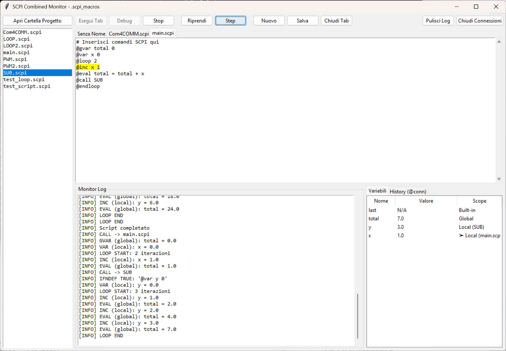

# SCPI Serial Monitor 📟


**A robust, thread-safe desktop application to communicate with and debug SCPI-compatible programmable instruments.**

Whether you are controlling a professional oscilloscope, a bench multimeter, or debugging a custom Arduino-based SCPI instrument, this tool provides a clean GUI, macro management, and asynchronous reading across multiple communication protocols.


 


## ✨ Features

- 🔌 **Multi-Protocol Support:**
  - **Serial (COM/USB):** Direct RS232/USB communication with baud rate selection.
  - **VISA:** Support for professional instruments via PyVISA (auto, NI, or Py backend).
  - **Raw Socket:** Direct TCP/IP connection to Ethernet-enabled instruments (usually port 5025).
- 🛡️ **Thread-Safe I/O:** Built-in lock mechanisms prevent race conditions between asynchronous unrequested output (e.g., a noisy serial line) and user queries.
- 🤖 **Macro Editor:** Create, edit, and save sequences of SCPI commands. Macros handle automatic delays between commands and wait for queries to complete.
- 📜 **Command History:** Use Up/Down arrows to navigate previously sent commands, or create a new Macro directly from your current history.
- 💾 **Session Memory:** The app remembers your recent connections (up to 12 profiles) and your last used UI settings, saving them in local `.json` files.
- ⚡ **Smart UI:** Buttons and inputs are dynamically enabled/disabled during command execution to prevent flooding the instrument with overlapping commands.

## 🛠️ Requirements

The application relies on Python's built-in `tkinter` for the GUI.
Depending on the protocols you plan to use, you will need the following Python packages:

Depending on the protocols you plan to use, you will need the following Python packages:

    pyserial>=3.5     # Required for Serial communication
    pyvisa>=1.13.0    # Required for VISA communication

*Note for VISA users: To use the `ni` backend, ensure you have the [NI-VISA Runtime](https://www.ni.com/en/support/downloads/software-products/download.ni-visa.html) installed on your system.*

## 🚀 Installation & Usage

1. **Clone the repository:**
       git clone https://github.com/GiuseppeLeviBo/SCPI_Serial_Monitor.git
       cd SCPI_Serial_Monitor

1. **Install dependencies:**
       pip install -r requirements.txt

   *(Note: Linux users might need to install Tkinter via their package manager, e.g., `sudo apt-get install python3-tk`).*

2. **Run the application:**
       python SCPI_serial_monitor.py
   
## 📖 How it Works

### Sending Commands
Type your SCPI command in the bottom input field and press `Enter` or click **Send**. 
- If the command ends with a `?` (e.g., `*IDN?`), the app will automatically treat it as a Query, waiting for a response and displaying it in the log.
- You can force a Query for commands that don't end in `?` by clicking the **Query** button.

### Macros
Macros allow you to automate testing sequences. 
- Click **New** to open the Macro Editor. 
- Write one command per line. 
- During execution, the application will pause for `0.1s` after standard write commands to allow slow instruments (like custom Arduino boards) to process the data, while it will actively wait for responses for query commands (`?`).
- You can Export/Import Macros to share them across different setups.

### Technical Detail: Thread Safety
When interfacing with embedded devices, an active background reader thread can accidentally "steal" bytes meant for a synchronous `query()`. This application solves this by wrapping I/O operations and the background reader loop in a `threading.Lock()`. This guarantees that when a query is sent, the UI waits safely, the background reader is paused, and the instrument's response is captured correctly without data corruption.


## 🧩 Combined Monitor V2 (`SCPI_combined_monitor_V2.py`)

`SCPI_combined_monitor_V2.py` is the advanced Combined Monitor: it includes a multi-tab editor, workspace-based `.scpi` files, a DSL with **global/local static variables**, full flow control, and an integrated **step-by-step debugger**.

Quick start:

```bash
python SCPI_combined_monitor_V2.py
```



---

## 🏗️ V2 Architecture

V2 is built around two main components:

1. **GUI (`CombinedMonitorApp`)**
   - Open project folder.
   - Browse `.scpi` files.
   - Multi-tab editor with Save/Save As.
   - Runtime log.
   - Debug panel (variables + current-line highlight).

2. **Engine (`CombinedScriptEngine`)**
   - Line-by-line DSL execution.
   - Multi-script call stack (`@call` / `@script`).
   - Variable scoping (global + per-script local static).
   - Loops (`@loop`, `@while`, `@break`).
   - Numeric operations (`@inc`, `@eval`).
   - ASCII/binary acquisition (`@readbin`, `@savebin`).
   - CSV logging (`@store`, `@startstore`, `@comment`).

---

## 🧠 DSL V2: Core Rules

Each line can be:
- a **meta-command** (`@...`), or
- a standard **SCPI command** (`*IDN?`, `MEAS:VOLT?`, ...).

Supported comments:
```text
# this line is ignored
```

### Value Resolution (`_resolve_value`)

When the DSL expects a value, resolution order is:

1. Quoted strings (`"abc"`, `'abc'`) ➜ literal string.
2. Built-in names (read-only) ➜ resolved first.
3. Variable name ➜ scope lookup (current-script local first, then global).
4. Numeric literal (`10`, `3.14`).
5. If still unresolved ➜ explicit error (no silent fallback to raw string).

> Note: if you want plain text that is not numeric, always quote it.

### Built-in read-only names

The engine exposes built-ins that are always available and cannot be overwritten:

- `last`
- `target`
- `script`
- `time`
- `date`
- `datetime`
- `csvname`
- `binname`

Attempting to assign these names through `@var`, `@gvar`, `@inc`, or `@eval` raises an explicit error.

### `@print`

> Note: if you want plain text that is not numeric, always quote it.

---

## 🌍 Variable Scope (Global vs Local Static)

### `@var` (local static)
```text
@print <arg1> [arg2 ...]
```
- Creates/updates a **local variable for the current script**.
- Locals are **static per script file**: they remain tied to that script name across nested `@call`s.

Logs a formatted text line in the monitor log (`INFO` level).  
Runtime behavior:

- requires at least one argument, otherwise raises `@print richiede almeno un argomento`;
- each argument is resolved via DSL rules when possible (variable/built-in/number), otherwise kept as raw text;
- arguments are joined and emitted as `PRINT: <text>`;
- does not change target/transport state (diagnostic/logging command).

Example:

```text
@print "Starting test step"
@print channel 1 ready
```
- Creates/updates a global variable shared by all scripts in the run.

---

## 🌍 Variable Scope (Global vs Local Static)

### `@var` (local static)
```text
@var name value
```
- Creates/updates a **local variable for the current script**.
- Locals are **static per script file**: they remain tied to that script name across nested `@call`s.

### `@gvar` (global)
```text
@gvar name value
```
- Creates/updates a global variable shared by all scripts in the run.

### Lookup (`_get_var`)
Precedence order:
1. current-script locals
2. globals

### `@inc`
```text
@inc name [step]
```
- Increments an existing variable (`step` defaults to `1`).
- Raises an error if variable is missing or non-numeric.
- Updates the variable in its original scope (local or global).

### `@eval`
```text
@eval dest = expression
```
- Evaluates a math expression in a safe environment (`math` functions enabled, builtins disabled).
- Supports `^` as power alias (`**`).
- Variables are case-insensitive.
- Assignment rule:
  - if `dest` exists globally (and is not shadowed by current local), update global;
  - otherwise create/update a local variable in current script.

Example:
```text
@gvar gain 2
@var x 3
@eval y = sin(x) * gain + 10
```
- `N` is resolved via `_resolve_value`.
- Nesting supported.

---

## 🔀 Flow Control

### Conditions
```text
@if <left> <op> <right> <action>
```
Supported operators: `==`, `!=`, `>`, `<`, `>=`, `<=`.

Action can be:
- another meta-command (`@halt`, `@wait`, `@store`, ...), or
- a SCPI command.

### Variable existence
```text
@ifdef name <action>
@ifndef name <action>
```
- Stops script execution immediately.

---

### Counted loop
```text
@loop N
  ...
@endloop
```
- `N` is resolved via `_resolve_value`.
- Nesting supported.

### Conditional loop
```text
@while <left> <op> <right>
  ...
@endwhile
```
- If condition is false at entry, the block is skipped until matching `@endwhile`.

### `@break`
```text
@break
```
- Forces exit from current loop (`@loop` or `@while`).

### `@halt`
```text
@halt
```
- Stops script execution immediately.

---

## 📡 Connections and I/O

### `@conn`
```text
@conn <name> serial <port> [baud=9600] [timeout_s=2.0] [terminator=\n]
@conn <name> visa <resource> [timeout_s=2.0] [backend=auto] [terminator=\n]
@conn <name> socket <host:port | host> [port=5025] [timeout_s=2.0] [terminator=\n]
```

### `@target`
```text
@target <name>
```
Selects the active target for subsequent SCPI commands.

### ASCII query behavior
- Any SCPI command ending with `?` is treated as a query.
- Reply is stored in `last`.
- On serial transports:
  - input flush before query (configurable),
  - multiline buffering to rebuild split responses,
  - automatic retry after timeout (1s).

### Binary flow
```text
@readbin
WAV:DATA?
@savebin wave.bin
```
- `@readbin` arms raw read for the *next* SCPI line.
- Data is stored in `last_bin`.
- `@savebin` writes `<stem>_<YYYYMMDD_HHMMSS>_<target><suffix>`.

### `@binname`
```text
@binname <name>
```
- Changes the in-memory default binary base name immediately.
- The name is built from arguments via `_build_name_from_args` (supports variables/built-ins and sanitization).
- Applied to subsequent binary save operations.

`@savebin` behavior with `@binname`:
- if `binname` is set, output is `<binname><suffix>` (default suffix `.bin` if missing);
- otherwise fallback is timestamp/target pattern: `<stem>_<YYYYMMDD_HHMMSS>_<target><suffix>`.

## 📝 Result Logging (`lastres.csv`)

Output file: `lastres.csv` in current working directory.

CSV header:
```text
timestamp;target;command;name;value
```
- Immediate return from current script to caller.

### `@store`
```text
@store <label>
@store <label> <explicit_value>
```
- Stores `last` (or explicit value) into CSV.

### `@startstore` / `@stopstore`
```text
@startstore [label]
@stopstore
```
- Automatic CSV save for each ASCII query response.
- Default label: `AUTO`.

### `@comment`
```text
@comment free text
```
- Inserts annotation row into CSV (`command=@comment`, `name=COMMENT`).

### `@csvname`
```text
@csvname <name>
```
- Changes the CSV output filename immediately.
- The name is built from arguments via `_build_name_from_args` (supports variables/built-ins and sanitization).
- If `.csv` extension is missing, it is automatically appended.
- The runtime updates `lastres_path` on the fly, so all subsequent `@store`, `@startstore`, and `@comment` writes go to the new file.

---

## 📚 Modular Scripts

### `@call` / `@script`
```text
@call script_name
@script script_name
```
- Equivalent aliases.
- In V2, scripts are loaded from the **currently opened workspace**.
- `.scpi` extension is appended automatically if missing.

### `@rts`
```text
@rts
```
- Immediate return from current script to caller.

---

## 🐞 Integrated Debugger

Start modes:
- **Run**: continuous execution.
- **Debug**: starts paused (step mode).

Controls:
- **Pause/Resume**: toggle step mode.
- **Step**: execute exactly one line.
- **Stop**: request safe stop.

Variable panel shows:
- always `last`,
- globals,
- all local static variables (with current script highlighted).

Editor behavior:
- highlights current executing line in yellow.

---

## ✅ Complete DSL V2 Example

```text
@conn dmm serial COM3 115200
@target dmm

@gvar limit 5
@var i 0

@loop 10
MEAS:VOLT?
@if last > limit @comment "threshold exceeded"
@inc i
@if i >= 10 @break
@endloop

@eval avg = (limit + i) / 2
@store average avg
```

---

## 🧪 Full Test Plan (Test Cases)

Below is a complete test suite designed to cover parser, DSL engine, I/O, and debugger behavior.

### A) Parser and DSL syntax

1. **Comments and blank lines**
   - Input: script with `#` and blank lines.
   - Expected: ignored, no error.

2. **Quoted tokenization**
   - Input: `@comment "phase 1: startup"`.
   - Expected: full text preserved.

3. **Malformed command error**
   - Input: `@eval a 1+2` (missing `=`).
   - Expected: error with script:line reference in log.

4. **Undefined variable**
   - Input: `@if x > 1 @halt` with undeclared `x`.
   - Expected: explicit undefined-variable error.

### B) Variable scope

5. **Local precedence over global**
   - Setup: `@gvar x 10`, then `@var x 3` in same script.
   - Expected: lookup for `x` resolves to `3`.

6. **Local static persistence per script**
   - Setup: script A sets `@var k 1`, calls B, then returns to A.
   - Expected: A's `k` is preserved.

7. **Shared global across scripts**
   - Setup: A sets `@gvar t 1`, B does `@inc t`.
   - Expected: updated value visible in A.

8. **`@inc` on non-numeric variable**
   - Setup: `@var s "abc"`, then `@inc s`.
   - Expected: typed numeric-conversion error.

9. **`@eval` updates existing global destination**
   - Setup: `@gvar p 1`, `@eval p = p + 1`.
   - Expected: global is updated.

10. **`@eval` creates local if destination is not global**
   - Setup: `@eval q = 2+2`.
   - Expected: `q` is local in current script.
11. **Built-in name assignment blocked**
   - Setup: `@var time 1` / `@gvar target "x"` / `@eval date = 1`.
   - Expected: explicit read-only built-in error.

### C) Conditions and control flow

12. **`@if` numeric true/false branches**
13. **`@if` string comparisons (`==`, `!=`)**
14. **`@ifdef` existing variable path**
15. **`@ifndef` missing variable path**
16. **`@loop` executes exact N iterations**
17. **`@while` natural exit path**
18. **`@break` inside nested loops (breaks current loop only)**
19. **Error on `@endloop` without opener**
20. **Error on `@break` outside loop**
21. **`@halt` interrupts run immediately**

### D) Call stack and modularity

22. **Basic `@call` with existing file**
23. **`@call` missing script**
24. **`@script` alias behavior**
25. **`@rts` early return**
26. **`@rts` from root frame ends execution**
27. **Multi-level nesting A→B→C with correct return PC**

### E) Transports and targets

28. **`@target` without `@conn`**
   - Expected: target-not-connected error.

29. **Serial connect defaults**
30. **VISA connect with auto/ni/py backends**
31. **Socket connect using `host:port` and split host+port formats**
32. **SCPI command without active target**
   - Expected: `No target selected` runtime error.

### F) ASCII queries and serial robustness

33. **Standard query populates `last`**
34. **Write command resets `last`**
35. **Serial multiline response reconstruction**
36. **Serial timeout + successful retry**
37. **Non-serial timeout propagates error (no retry)**
38. **Serial pre-query flush enabled behavior**

### G) Binary

39. **`@readbin` + valid binary query**
40. **`@savebin` without `last_bin` ➜ error**
41. **Output filename format includes timestamp + target (when `binname` is empty)**
42. **After `@readbin`, `last` must be `None`**
43. **`@binname` forces fixed binary output stem for subsequent saves**

### H) CSV logging

44. **`lastres.csv` header creation on first store**
45. **`@store label` saves `last`**
46. **`@store label explicit_value` saves explicit value**
47. **`@startstore` saves every query**
48. **`@stopstore` disables autosave**
49. **`@comment` appends comment row**
50. **Newline sanitization (`\r\n` / `\r`)**
51. **Multiline CSV value quoting correctness**

### I) Debugger/UI workflow

52. **Normal run: no `step_event` blocking**
53. **Debug start: pause on first line**
54. **Single-step advances exactly one line**
55. **Pause↔Resume synchronization**
56. **Stop during pause unblocks thread and exits**
57. **Variable tab updates (built-ins/global/local)**
58. **Current-line highlight on correct tab**
59. **No crash when script is not open in any tab**

### J) Error handling and resilience

60. **Runtime error log includes `script_name:L<line>`**
61. **After runtime error, `stop_requested=True` and run ends**
62. **`close_all()` tolerates disconnect exceptions**

### K) Print command

63. **`@print` with no args raises explicit error**
64. **`@print` with one arg logs `PRINT: ...`**
65. **`@print` with mixed args (built-in/var/literal) logs resolved text**

### L) Runtime output naming

66. **`@csvname` without extension appends `.csv`**
67. **`@csvname` switches `lastres_path` immediately for next write**
68. **`@binname` updates in-memory binary default name immediately**
69. **Quoted `@csvname` / `@binname` arguments preserve spaces in names**
70. **Filename sanitization replaces forbidden characters and collapses spaces/underscores**

---

## 🔧 Recommended Test Execution Strategy

- **Engine unit tests**: mock transports (`SerialTransport`, `VisaTransport`, socket) + fake logger.
- **DSL integration tests**: fixture scripts in a temporary workspace folder.
- **UI smoke tests**: basic automated flow (open tab, run/debug, stop) where feasible.
- **Minimal CI regression set**:
  1. Variable scope (`@var/@gvar/@eval/@inc`)
  2. Loops and call stack
  3. Serial multiline query + retry
  4. CSV logging and binary flow


## 📄 License

This project is licensed under the MIT License - see the [LICENSE](LICENSE) file for details.
