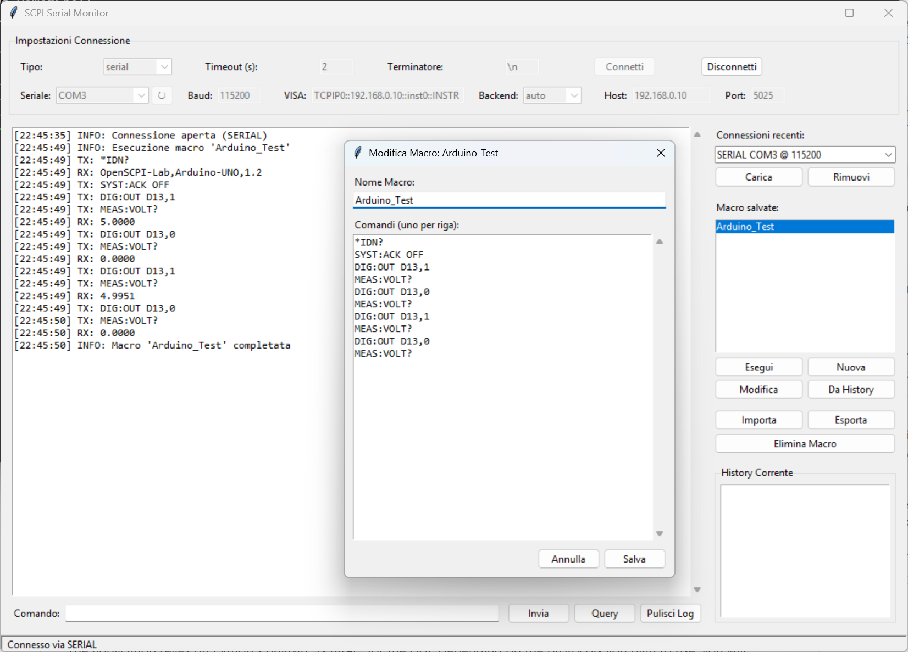

# SCPI Serial Monitor 📟

**A robust, thread-safe desktop application to communicate with and debug SCPI-compatible programmable instruments.**

Whether you are controlling a professional oscilloscope, a bench multimeter, or debugging a custom Arduino-based SCPI instrument, this tool provides a clean GUI, macro management, and asynchronous reading across multiple communication protocols.

> **[📝 NOTE]** 
> *Add a screenshot of your application here! Just replace the path below:*
> 
> 

## ✨ Features

- 🔌 **Multi-Protocol Support:**
  - **Serial (COM/USB):** Direct RS232/USB communication with baud rate selection.
  - **VISA:** Support for professional instruments via PyVISA (auto, NI, or Py backend).
  - **Raw Socket:** Direct TCP/IP connection to Ethernet-enabled instruments (usually port 5025).
- 🛡️ **Thread-Safe I/O:** Built-in lock mechanisms prevent race conditions between asynchronous unrequested output (e.g., a noisy serial line) and user queries.
- 🤖 **Macro Editor:** Create, edit, and save sequences of SCPI commands. Macros handle automatic delays between commands and wait for queries to complete.
- 📜 **Command History:** Use Up/Down arrows to navigate previously sent commands, or create a new Macro directly from your current history.
- 💾 **Session Memory:** The app remembers your recent connections (up to 12 profiles) and your last used UI settings, saving them in local `.json` files.
- ⚡ **Smart UI:** Buttons and inputs are dynamically enabled/disabled during command execution to prevent flooding the instrument with overlapping commands.

## 🛠️ Requirements

The application relies on Python's built-in `tkinter` for the GUI.
Depending on the protocols you plan to use, you will need the following Python packages:

